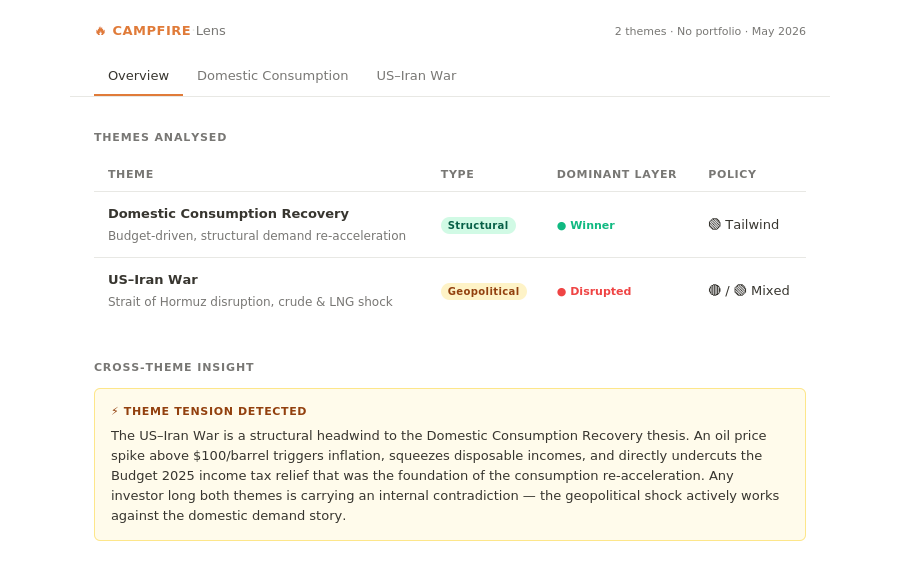
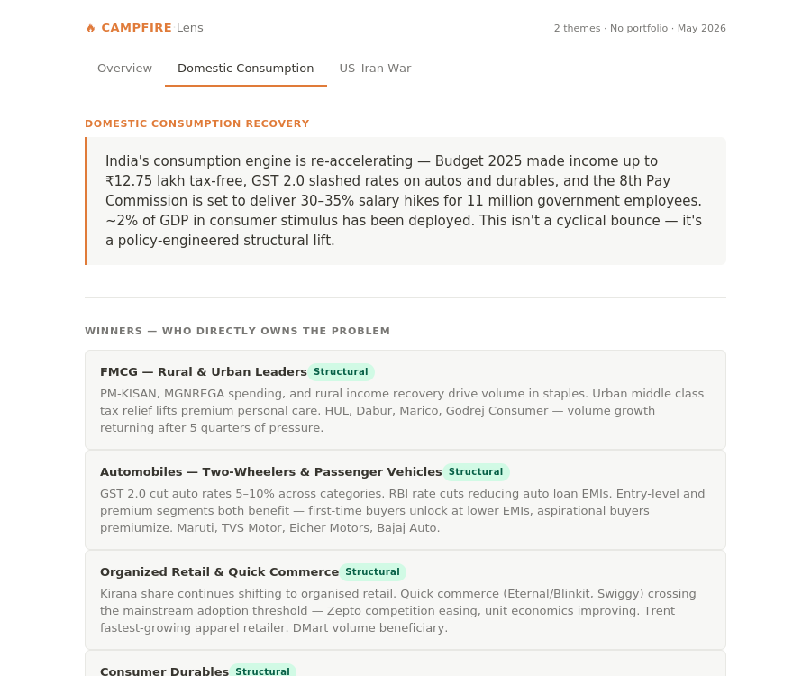
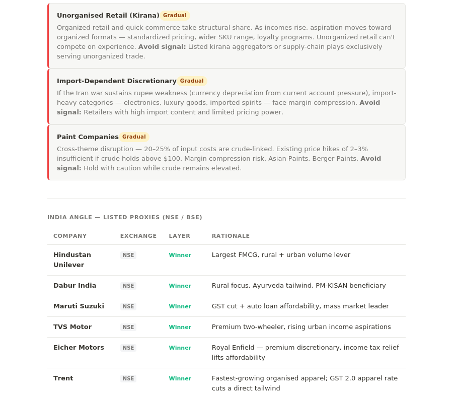
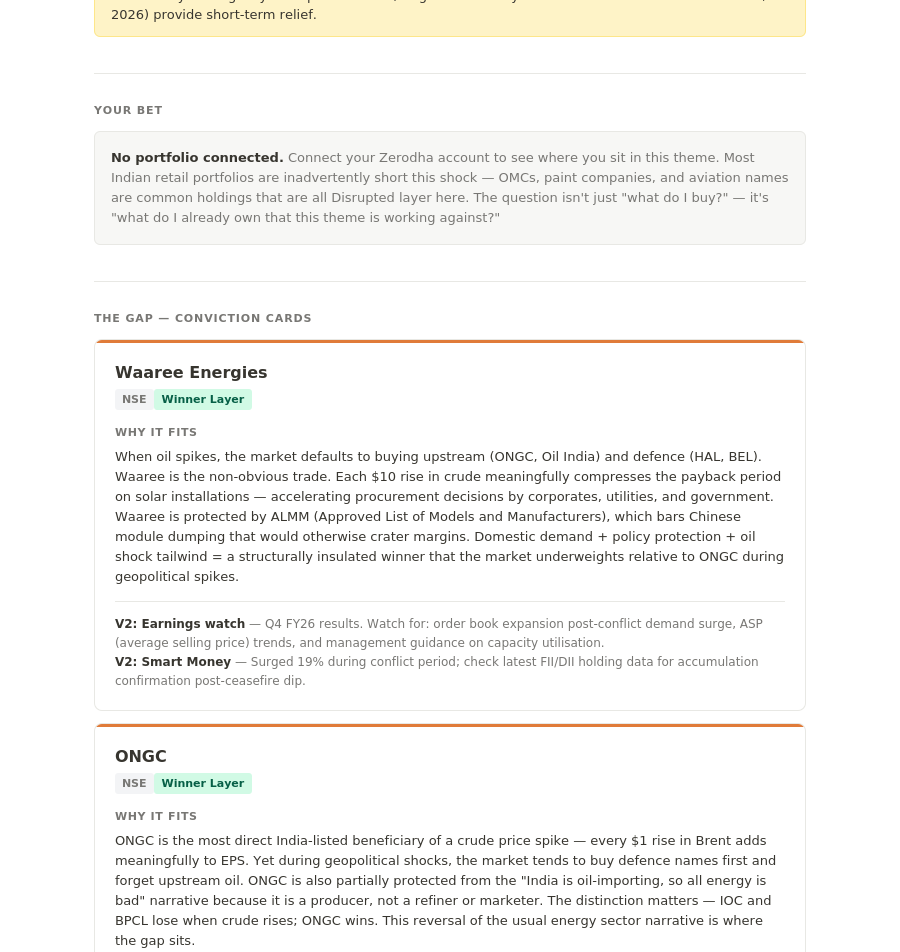

# Campfire Lens

**A Claude skill for Indian equity investors.**

Your portfolio has a point of view on the world. Campfire Lens finds it.

Pick any market theme — AI inference, China+1 manufacturing, green hydrogen. Lens maps the full value chain, finds India's specific position in it, then checks your live Zerodha holdings to show what you're implicitly betting on, what's missing, and what's at risk.

---

## Screenshots

**Overview — multi-theme heatmap with cross-theme tension detection**

**Domestic Consumption Recovery — Spark, Winners & Enablers**

**India Angle — listed proxies with layer classification and policy flags**

**The Gap — conviction cards with earnings watch and smart money signals**

---

## What it does

**For any theme you run:**
- Maps global Winners, Enablers, and Disrupted players across the value chain
- Finds India listed proxies (NSE / BSE / BSE SME / NSE Emerge) with policy context
- Reads your Zerodha portfolio to show where you sit in the chain
- Surfaces conviction cards at The Gap — the one or two names that matter

**Across a multi-theme session:**
- Builds a Portfolio Heatmap showing your exposure across all themes
- Flags overweight concentration and underweight gaps
- Detects thesis drift when you revisit a theme over time
- Surfaces cross-sector thematic exposure your sector allocation hides

---

## The Framework

Seven layers. Three acts.

| Layer | Name | What it answers |
|-------|------|----------------|
| 0 | Spark | What's happening and why now |
| 1 | Winners | Who directly owns the problem globally |
| 2 | Enablers | Who enables the winners (picks & shovels) |
| 3 | Disrupted | Who loses — the avoid signal |
| 4 | India Angle | India's position across all three layers, listed only |
| 5 | Your Bet | What your portfolio is implicitly saying |
| 6 | The Gap | One or two names conviction demands you examine |

---

## Output

A single tabbed HTML dashboard:

- **Heatmap Tab** — portfolio exposure matrix across all themes, overweight/underweight warnings, sectoral cross-mapping, thesis drift alerts
- **Per-Theme Tabs** — full 7-layer output with conviction cards, policy flags, and FII/DII flow indicators

Same design language as Campfire Analyst — Notion-like minimalist, self-contained HTML.

---

## Install

1. Download `campfire-lens.zip` from [Releases](https://github.com/subodhkolhe/campfire-lens/releases)
2. Open [claude.ai](https://claude.ai) → click your profile → **Customize**
3. Go to **Browse Plugins** → **Upload custom plugin** → select the zip
4. Type `/campfire-lens` to start

Works immediately for value chain analysis and India proxy research. Portfolio features require the one-time Kite MCP setup below.

---

## Prerequisites — Kite MCP (for portfolio features)

Portfolio-linked features (Your Bet, overweight/underweight warnings, thesis drift alerts) require Kite MCP to be connected. This is a one-time setup:

1. Open [claude.ai](https://claude.ai) → click your profile → **Customize**
2. Go to **Connections** or **MCP Servers**
3. Click **Add MCP Server**
4. Enter this URL: `https://mcp.kite.trade/mcp`
5. Authenticate with your Zerodha credentials when prompted
6. Return to Campfire Lens — portfolio features activate automatically

**Without Kite MCP:** Campfire Lens runs in research-only mode — full 7-layer value chain, India proxies, policy flags, and conviction cards all work. Your Bet and heatmap warnings are unavailable until Kite is connected.

**Privacy:** Lens pulls a fresh holdings snapshot each session. No data is stored between sessions.

---

## Version

**Current: V1 + V2 (combined release)**

V1 — Core framework, multi-theme, heatmap, conviction cards, listed proxies, overweight/underweight warnings, sectoral cross-mapping, policy flags, thesis drift alerts

V2 — Smart Money Alignment (FII/DII flows), earnings cycle awareness on conviction cards, SME board proxies, conviction scoring per theme (High / Medium / Low)

V2 features degrade gracefully when data is unavailable — they enhance output rather than gate it.

**Planned: V3**
Pre-IPO and VC-backed India proxies · Domain Knowledge registry · Quantitative conviction scoring

---

## Part of the Campfire Suite

| Skill | What it does |
|-------|-------------|
| [Campfire Analyst](https://github.com/subodhkolhe/campfire-analyst) | Reads your portfolio — health, vitals, fragmentation, identity |
| **Campfire Lens** | Maps themes against your portfolio — what you're betting on, what's missing |

Analyst reads your portfolio's health. Lens reads your portfolio's thematic positioning. Together, a complete picture.

---

## Disclaimer

All company references are for analytical and educational purposes only — not recommendations to buy, sell, or hold any security. Not SEBI registered investment advice.

---

## Author

Subodh Kolhe · Apache 2.0 License · 2026
